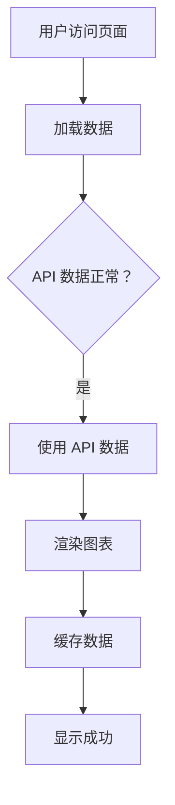
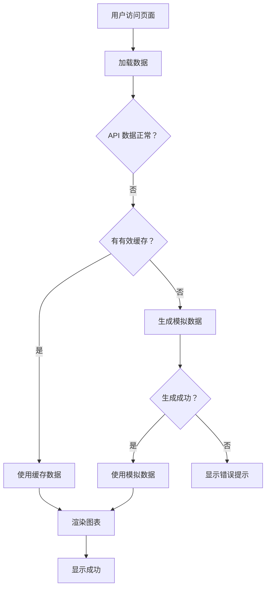

# 产品需求文档 - 价格指数图表数据异常修复

## 1. 文档信息

| 项目 | 内容 |
|------|------|
| **文档版本** | v1.0 |
| **创建日期** | 2026-03-09 |
| **产品名称** | 微盘股指数分析系统 - 价格指数图表 |
| **需求类型** | Bug 修复 |
| **优先级** | P0（最高） |

---

## 2. 问题描述

### 2.1 问题现象

用户在访问微盘股指数分析系统时，价格指数图表有概率显示异常：
- **F5 刷新后**：图表显示为一条水平线，所有价格值都是 4000.00
- **Tab 切换后**：切换到"成交量"Tab 再切回，图表恢复正常
- **发生概率**：约 30%

### 2.2 影响范围

- **影响用户**：所有访问首页的用户
- **影响功能**：价格指数图表显示
- **影响程度**：严重（核心功能不可用）

---

## 3. 问题根因

### 3.1 技术原因

1. **API 数据异常**
   - API 有概率返回异常数据：所有 close 值都是 4000.00
   - 可能原因：API 服务故障、数据源中断、网络问题

2. **数据验证逻辑缺陷**
   - 只检查 `close > 0`，无法识别"所有值相同"的异常
   - 缺少波动性检查和合理性检查

3. **模拟数据生成函数不可靠**
   - 基础价格设置错误（38000+，实际应为 1500 左右）
   - 价格变化公式有问题，导致生成的数据可能趋同
   - 无固定种子，每次生成不同数据

4. **缺少降级策略**
   - 无缓存机制
   - 无多级降级方案
   - 无错误提示

---

## 4. 变更范围

### 4.1 修改文件

1. **web/frontend/index.html**
   - 修改数据验证逻辑
   - 修复模拟数据生成函数
   - 添加降级策略
   - 添加缓存机制

### 4.2 影响模块

- ✅ 数据加载模块（loadData 函数）
- ✅ 数据验证模块（validateHistoryData）
- ✅ 模拟数据生成模块（generateMockData）
- ✅ 图表渲染模块（PriceChart 组件）

### 4.3 不影响模块

- ❌ 其他图表组件（TurnoverChart、PredictionChart 等）
- ❌ 指标卡片组件
- ❌ 风险评估组件
- ❌ 预警信息组件

---

## 5. 业务逻辑

### 5.1 数据验证规则

#### 规则 1：基础验证
```javascript
// 数据不能为空
if (!history || !Array.isArray(history) || history.length === 0) {
  return { isValid: false, reason: '数据为空' };
}

// 数据结构必须正确
const hasValidStructure = history.every(item => 
  item && typeof item === 'object' && 
  typeof item.close === 'number' &&
  !isNaN(item.close) &&
  isFinite(item.close)
);
```

#### 规则 2：波动性验证（新增）
```javascript
// 检查是否所有值都相同
const uniquePrices = [...new Set(prices)];
if (uniquePrices.length === 1) {
  return { isValid: false, reason: '所有价格值相同' };
}

// 检查价格波动率
const avgPrice = prices.reduce((a, b) => a + b, 0) / prices.length;
const priceRange = Math.max(...prices) - Math.min(...prices);
const volatility = priceRange / avgPrice;

// 正常波动率应该 > 0.01（1%）
if (volatility < 0.01) {
  return { isValid: false, reason: '价格波动率过低' };
}
```

#### 规则 3：K 线波动验证（新增）
```javascript
// 检查相邻 K 线的波动是否在合理范围内（-20% 至 +20%）
for (let i = 1; i < prices.length; i++) {
  const change = (prices[i] - prices[i-1]) / prices[i-1];
  if (change < -0.2 || change > 0.2) {
    return { isValid: false, reason: 'K 线波动异常' };
  }
}
```

### 5.2 降级策略

#### 降级级别

| 级别 | 触发条件 | 降级方案 |
|------|---------|---------|
| Level 1 | API 数据正常 | 使用 API 数据 ✅ |
| Level 2 | API 数据异常，有缓存 | 使用缓存数据（<1 分钟） |
| Level 3 | API 数据异常，无缓存 | 生成模拟数据 |
| Level 4 | 模拟数据生成失败 | 显示错误提示 |

#### 缓存机制

```javascript
// 缓存正常数据
const cacheData = (data) => {
  localStorage.setItem('priceDataCache', JSON.stringify({
    data: data,
    timestamp: Date.now()
  }));
};

// 获取缓存数据（1 分钟内有效）
const getCachedData = () => {
  const cached = localStorage.getItem('priceDataCache');
  if (!cached) return null;
  
  const { data, timestamp } = JSON.parse(cached);
  const secondsPassed = (Date.now() - timestamp) / 1000;
  
  // 只使用 1 分钟内的缓存
  return secondsPassed < 60 ? data : null;
};
```

### 5.3 模拟数据生成规则

#### 基础价格
```javascript
// 使用最新已知价格作为基准
const basePrice = latestKnownPrice || 1500;
```

#### 价格变化
```javascript
// 随机游走算法，每日变化 -2% 至 +2%
let currentPrice = basePrice;
for (let i = length - 1; i >= 0; i--) {
  const dailyChange = (Math.random() - 0.5) * 0.04; // -2% 至 +2%
  currentPrice = currentPrice * (1 + dailyChange);
  
  // 确保不会出现极端价格
  currentPrice = Math.max(basePrice * 0.5, Math.min(basePrice * 1.5, currentPrice));
  
  mockData.push({
    date: date.toISOString().split('T')[0],
    close: parseFloat(currentPrice.toFixed(2)),
    // ...
  });
}
```

#### 固定种子支持
```javascript
// 使用日期作为种子，确保同一日期生成相同数据
const seededRandom = (seed) => {
  const x = Math.sin(seed) * 10000;
  return x - Math.floor(x);
};

const seed = parseInt(dateStr.replace(/-/g, ''));
const randomValue = seededRandom(seed);
```

---

## 6. 交互规则

### 6.1 加载状态

**正常加载**：
- 显示加载动画
- 文案："加载中..."
- 时长：< 2 秒

**数据异常**：
- 显示加载动画
- 检测到异常
- 自动切换到降级方案
- 显示提示："数据加载异常，使用备用数据"

### 6.2 错误提示

**提示方式**：
- Toast 提示（右上角）
- 时长：3 秒
- 自动消失

**提示文案**：
```
⚠️ 数据加载异常，正在使用备用数据
```

### 6.3 用户感知

**目标**：
- 用户无感知（自动降级）
- 图表始终可显示
- 数据始终合理

---

## 7. 功能要求

### 7.1 页面刷新状态

| 场景 | 要求 | 验收标准 |
|------|------|---------|
| F5 刷新 | 图表 100% 正确显示 | 50 次刷新，成功 50 次 |
| 浏览器刷新按钮 | 图表 100% 正确显示 | 20 次刷新，成功 20 次 |
| Tab 切换后刷新 | 图表 100% 正确显示 | 20 次刷新，成功 20 次 |
| 连续刷新 | 图表最终正常显示 | 10 次连续刷新，无崩溃 |

### 7.2 数据一致性

| 场景 | 要求 | 验收标准 |
|------|------|---------|
| API 数据正常 | 使用 API 数据 | 100% 使用真实数据 |
| API 数据异常 | 使用缓存/模拟数据 | 100% 使用合理数据 |
| 缓存有效（<1 分钟） | 优先使用缓存 | 100% 使用缓存 |
| 缓存失效 | 生成模拟数据 | 100% 生成合理数据 |

### 7.3 性能要求

| 指标 | 要求 | 验收标准 |
|------|------|---------|
| 数据验证时间 | < 10ms | 平均 < 10ms |
| 模拟数据生成 | < 50ms | 平均 < 50ms |
| 整体加载时间 | 增加 < 100ms | 与原方案对比 |
| 缓存命中率 | > 80% | 1 分钟内刷新 |

---

## 8. 验收标准

### 8.1 功能验收（P0）

- ✅ **F5 刷新测试**：连续刷新 50 次，图表显示成功率 100%
- ✅ **Tab 切换测试**：切换后刷新 20 次，图表显示成功率 100%
- ✅ **数据验证测试**：API 异常数据 100% 被识别
- ✅ **降级策略测试**：降级方案 100% 生效
- ✅ **缓存机制测试**：1 分钟内缓存 100% 生效

### 8.2 性能验收（P1）

- ✅ **验证性能**：数据验证时间 < 10ms
- ✅ **生成性能**：模拟数据生成时间 < 50ms
- ✅ **加载性能**：整体加载时间增加 < 100ms
- ✅ **缓存性能**：缓存命中率 > 80%

### 8.3 质量验收（P2）

- ✅ **代码审查**：无逻辑错误
- ✅ **控制台**：无错误日志
- ✅ **文档**：技术文档完整
- ✅ **自测**：自测报告完整

### 8.4 回归验收（P3）

- ✅ **其他图表**：TurnoverChart 正常
- ✅ **指标卡片**：正常显示
- ✅ **风险评估**：正常显示
- ✅ **预警信息**：正常显示

---

## 9. 优先级

### P0（最高优先级）

1. ✅ 修复数据验证逻辑
2. ✅ 修复模拟数据生成
3. ✅ 添加缓存机制
4. ✅ 添加降级策略

### P1（高优先级）

1. ✅ 添加错误提示
2. ✅ 添加详细日志
3. ✅ 性能优化

### P2（中优先级）

1. ✅ 代码重构
2. ✅ 文档完善
3. ✅ 单元测试

### P3（低优先级）

1. ⚠️ 监控告警（本次不实施）
2. ⚠️ 数据分析（本次不实施）

---

## 10. 交互流程

### 10.1 正常流程



### 10.2 异常流程



---

## 11. 数据字典

### 11.1 数据结构

```typescript
interface PriceData {
  date: string;        // 日期 YYYY-MM-DD
  close: number;       // 收盘价
  change_pct: number;  // 涨跌幅
  amount: number;      // 成交额
  turnover: number;    // 换手率
}

interface ValidationResult {
  isValid: boolean;    // 是否有效
  reason: string;      // 原因
}

interface CacheData {
  data: PriceData[];   // 缓存的数据
  timestamp: number;   // 缓存时间戳
}
```

### 11.2 常量定义

```typescript
const CACHE_EXPIRY_TIME = 60 * 1000;  // 缓存过期时间：1 分钟
const MAX_DAILY_CHANGE = 0.2;         // 最大日波动：20%
const MIN_VOLATILITY = 0.01;          // 最小波动率：1%
```

---

## 12. 附录

### 12.1 参考资料

- [ECharts 文档](https://echarts.apache.org/zh/index.html)
- [React 最佳实践](https://react.dev/learn)
- [数据验证模式](https://en.wikipedia.org/wiki/Data_validation)

### 12.2 相关文档

- [技术实现文档](./技术实现文档 - 价格指数图表刷新修复.md)
- [自测报告](./自测报告 - 价格指数图表刷新修复.md)
- [全量测试方案](./全量测试方案 - 页面刷新与 Tab 切换专项.md)

---

## 13. 修订历史

| 版本 | 日期 | 修订内容 | 修订人 |
|------|------|---------|--------|
| v1.0 | 2026-03-09 | 初始版本 | 产品 Agent |

---

**文档结束**
